# Pipelined Mips

Pipeined Mips Microprocessor using VHDL, 34 Instructions including Rtype,
Itype, Branching, Jumping and memory access instructions.

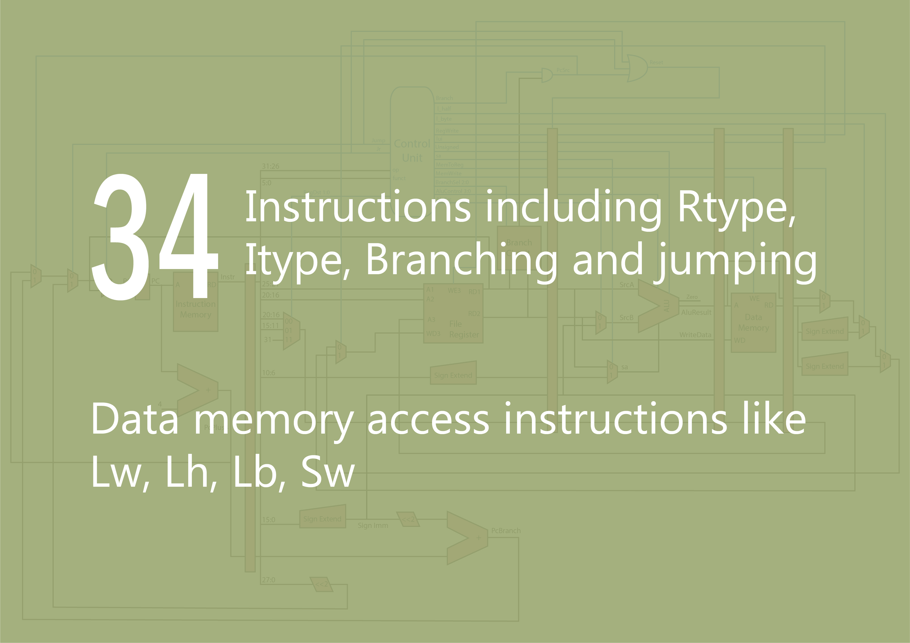

### Pipelined Mips Design

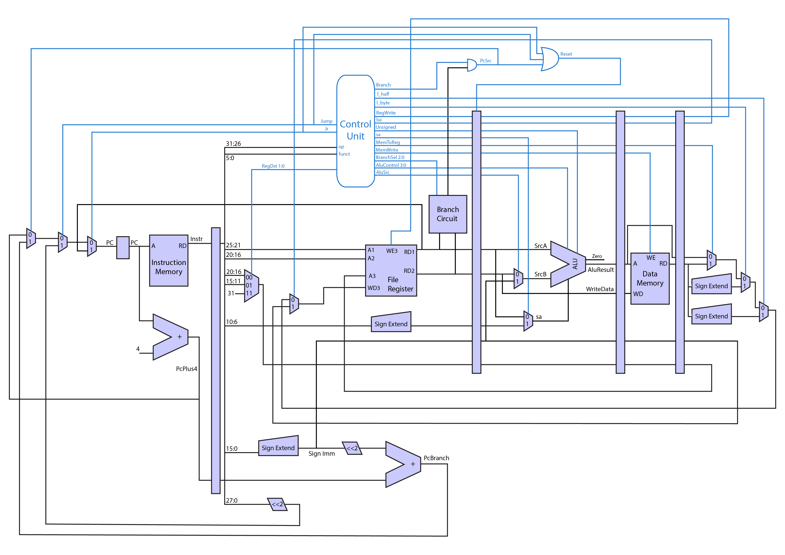

##### Rtype Instructions
  - ADD
  - ADDU
  - AND
  - NOR
  - OR
  - SLT
  - SLTU
  - SUB
  - SUBU
  - XOR
  - SLL
  - SLLV
  - SRL
  - SRLV
  
##### Itype Instructions
   - ADDI
   - ADDIU
   - ANDI
   - ORI
   - SLTI
   - SLTIU
   - XORI
   - LUI
  
##### Branching Instructions
   - BGTZ
   - BLTZ
   - BEQ
   - BNE
   - BGEZ
   - BLEZ
  
##### Jumping Instructions
   - J
   - JR
  
##### Memory Access Instructions
   - SW
   - LW
   - LH
   - LB

# Instructions Path

##### Rtype Instructions
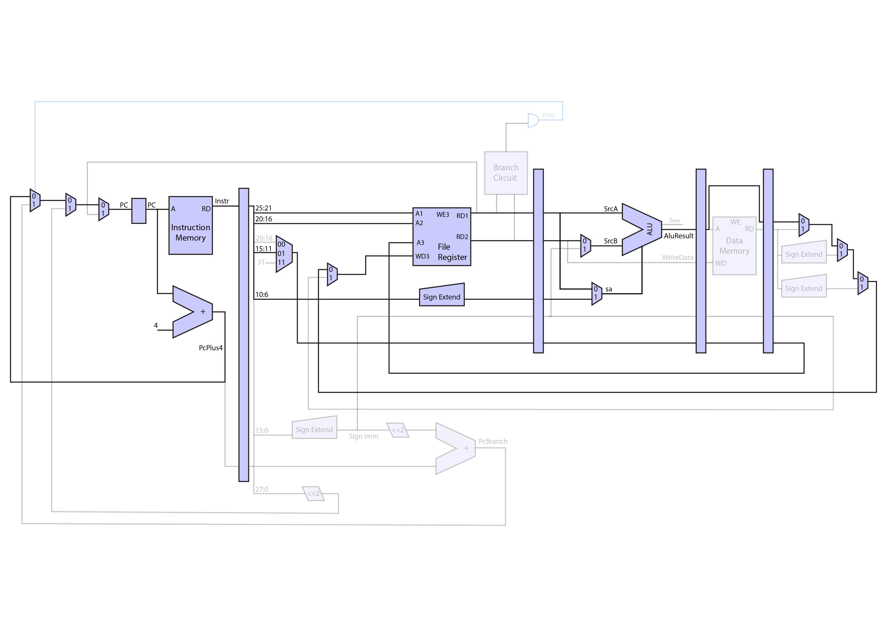

##### Itype Instructions
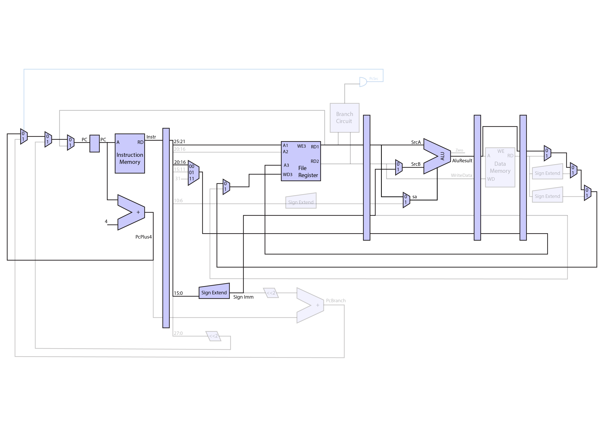

##### Branching Instructions
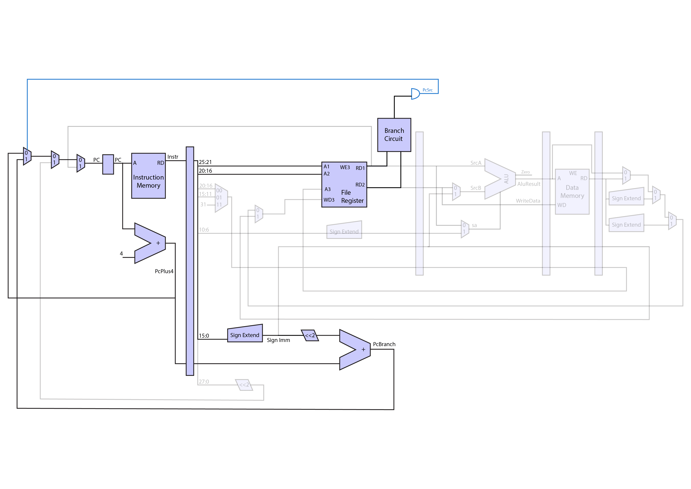

##### Jumping Instructions
Jump
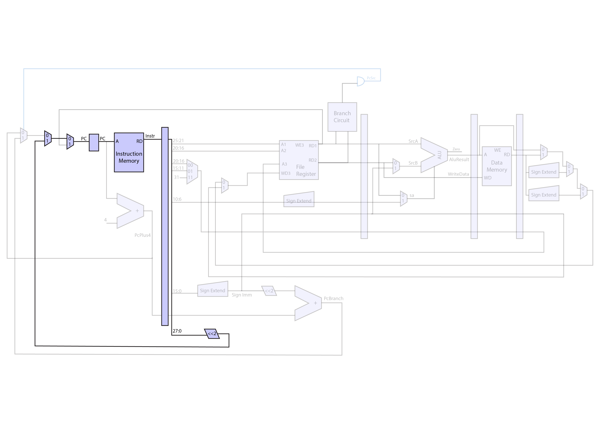
Jr
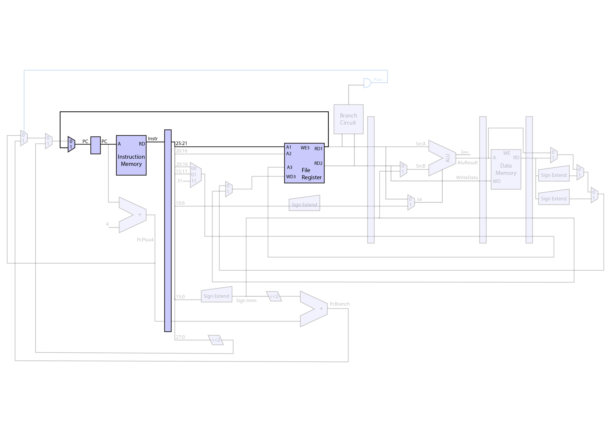

##### Memory Access Instructions
Lw, Lh, Lb
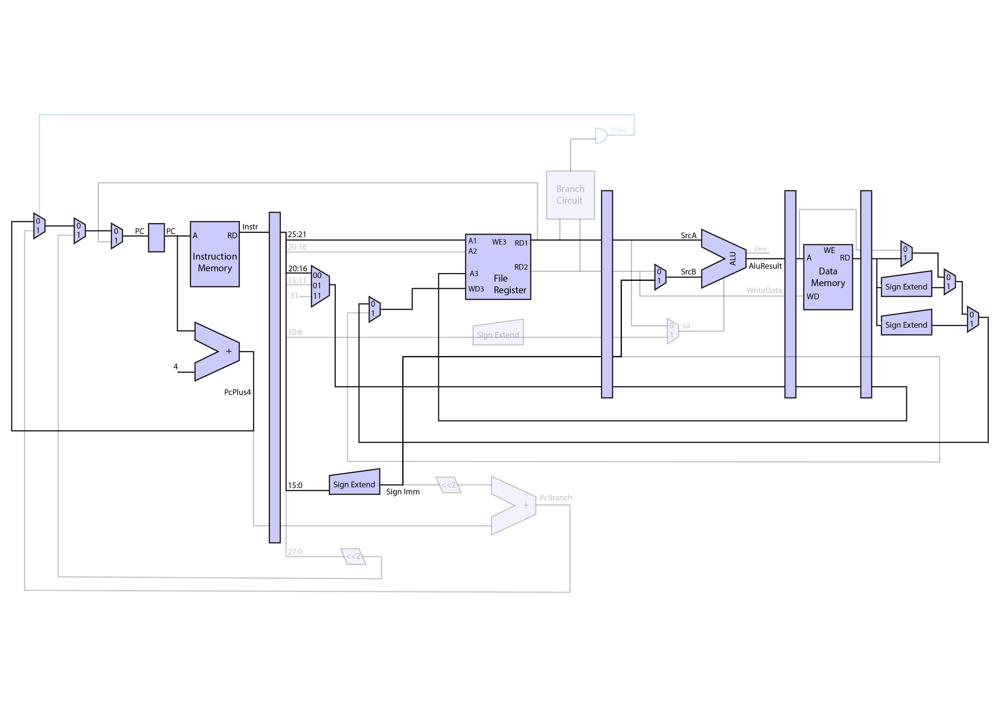
Sw
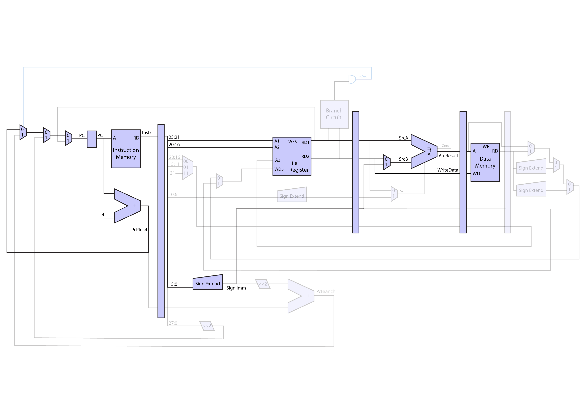

# Branching Circuit
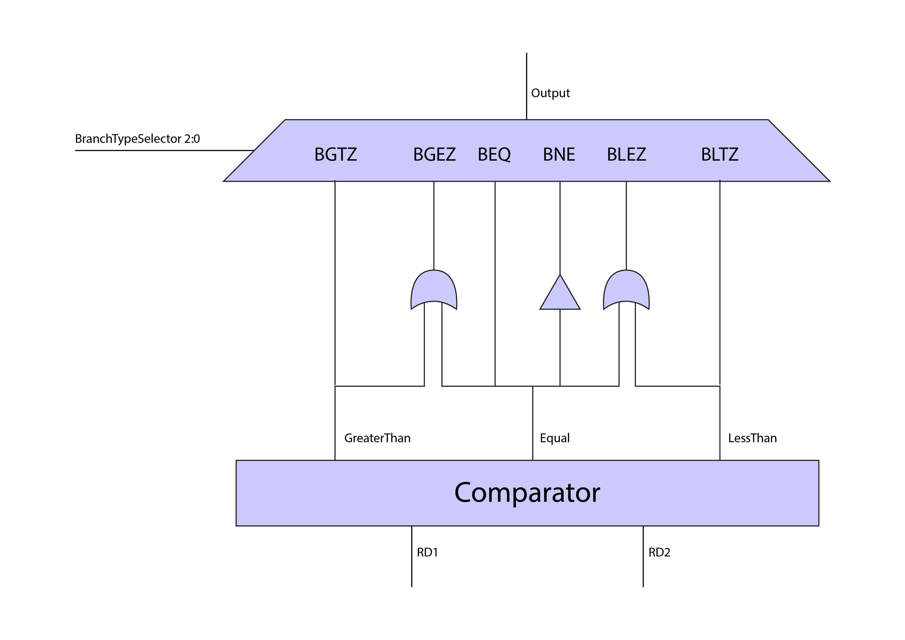

# Control Circuit

#### Control Signals Circuit
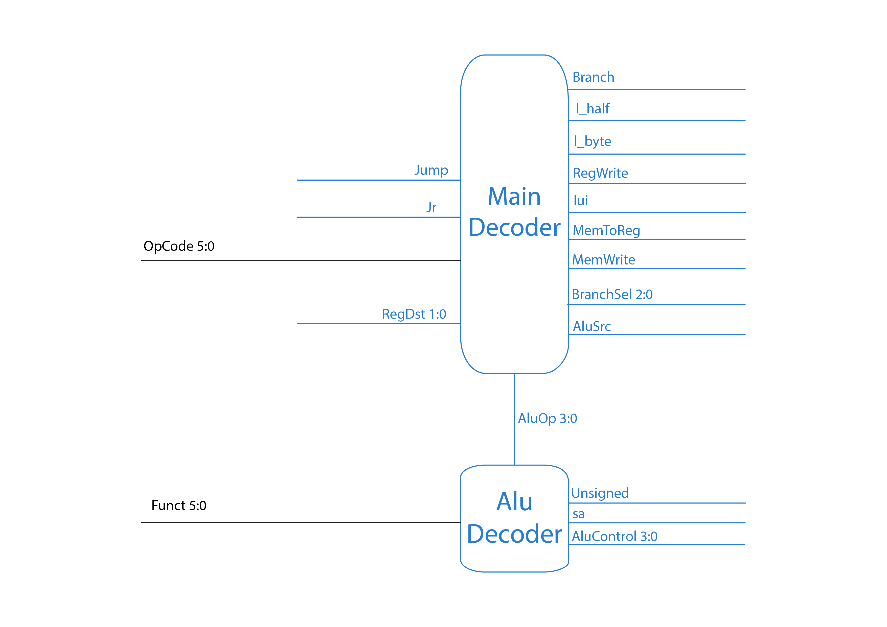

#### Main Decoder Signals
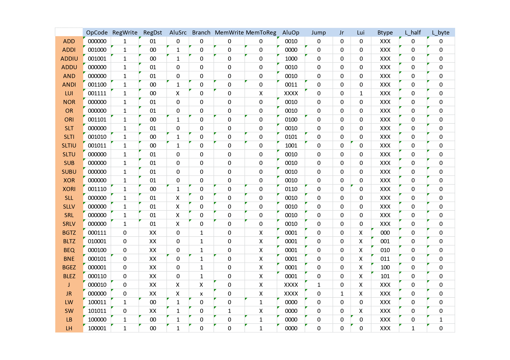

#### ALU Decoder Signals
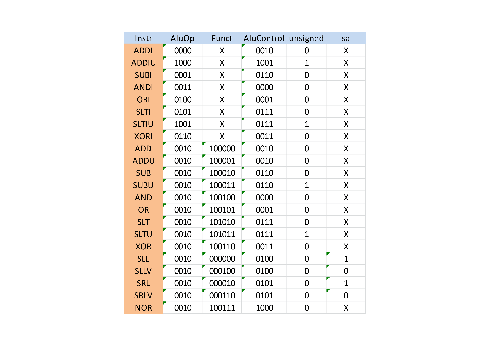

